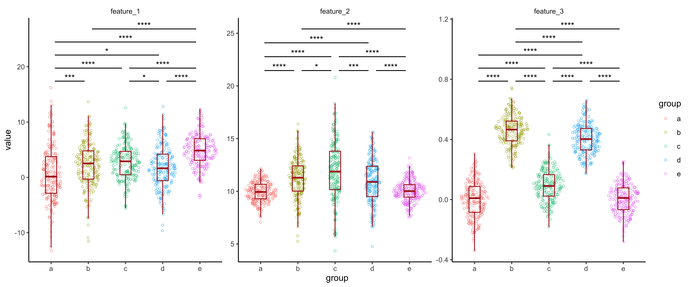
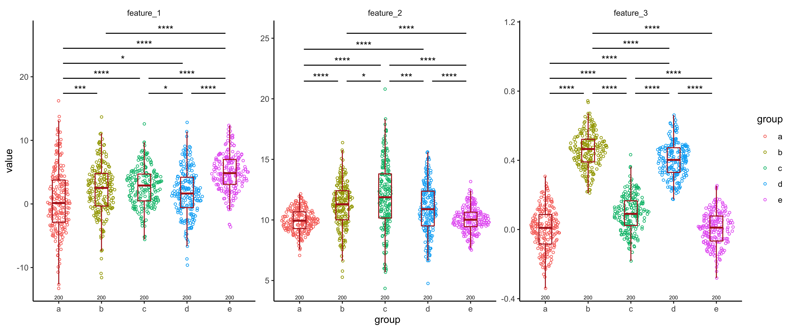
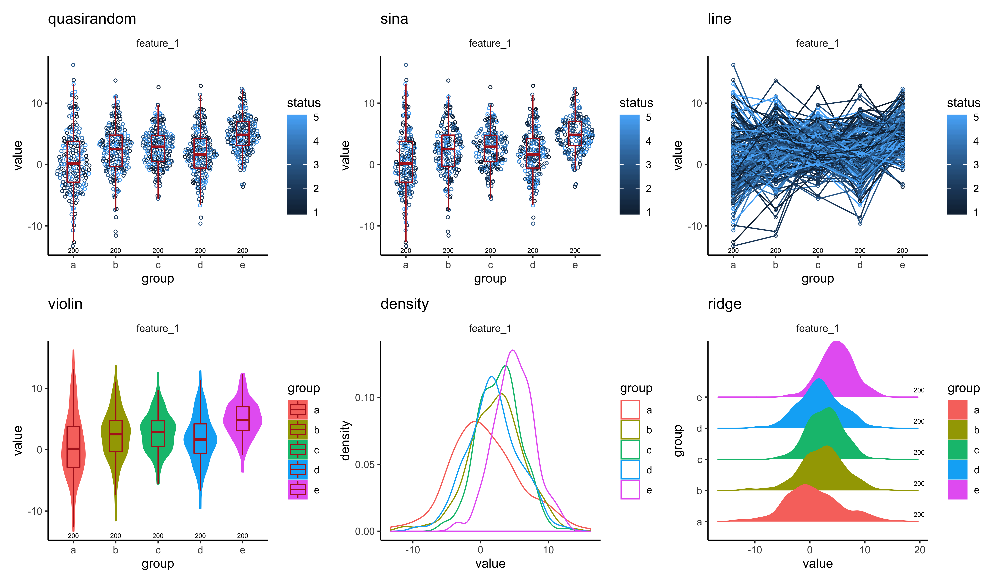

ggexp
================

Provides several plotting utilities to aid in performing exploratory
analysis with publication-quality figures.

## Key functions

  - `plot_pairwise_annotation`: Plot a pairwise annotation (such as the
    results of pairwise statistical tests) onto a plot with a discrete
    x-axis and continuous y-axis and automatically assign the tiers to
    minimize the number of tiers needed to plot the comparisons.
  - `plot_distributions`: Plot distributions with flexibility of quickly
    changing plot attributes in a one-liner.
  - `plot_pairwise_scatterplot`: Plot a pairwise scatterplot.
  - `plot_barplot`: Plot a barplot with annotations and easily switch
    between stacked, unstacked and adjust text annotations accordingly.
  - `theme_ggexp`: Variation on `ggplot2::theme_classic` with a blank
    strip background for facets.
  - `get_palette`: Generate consistent and ordered palettes based on
    palettes from `ggsci`.

### `plot_pairwise_annotation`

We generate some random data for illustration purposes. This consists of
a total of 5 groups to compare across for a total of 3 features. For
each of these features, we compute the p-values for pairwise Wilcoxon
rank-sum test, and annotate these comparisons on a `geom_sina` plot.

``` r
library(ggexp)
library(ggplot2)
library(magrittr)

set.seed(1234)

data = data.frame(
  "feature" = rep(c("feature_1", "feature_2", "feature_3"), each = 1000),
  "value" = c(
    c(
      rnorm(200, 1, 5),
      rnorm(200, 2, 4),
      rnorm(200, 3, 3),
      rnorm(200, 2, 4),
      rnorm(200, 5, 3)
    ),
    c(
      rnorm(200, 10, 1),
      rnorm(200, 11, 2),
      rnorm(200, 12, 3),
      rnorm(200, 11, 2),
      rnorm(200, 10, 1)
    ),
    c(
      rnorm(200, 0, .11),
      rnorm(200, .45, .1),
      rnorm(200, .10, .11),
      rnorm(200, .4, .1),
      rnorm(200, 0, .1)
    )
  ),
  "group" = rep(rep(c(
    "a", "b", "c", "d", "e"
  ), each = 200), 3),
  "id" = rep(1:200, 15),
  "status" = rep(1:5, 600)
)

wilcox_results = data %>%
  tidyr::nest(-feature) %>%
  dplyr::mutate(test = purrr::map(data, ~ as.data.frame(rstatix::wilcox_test(.x, value ~ group)))) %>%
  dplyr::select(feature, test) %>%
  tidyr::unnest(test)

plot = ggplot(data, aes(x = group, y = value, color = group)) +
  ggforce::geom_sina(shape = 1,
                     size = 1,
                     alpha = 0.5) +
  geom_boxplot(
    alpha = 0,
    width = 0.3,
    outlier.size = 0,
    position = position_dodge(width = 1),
    color = "firebrick"
  ) +
  facet_wrap(~ feature, scales = "free") +
  ggexp::theme_ggexp()

plot_pairwise_annotation(
  plot = plot,
  pairwise_annotation = wilcox_results,
  label = "p.adj.signif",
  values_to_exclude = "ns",
  tier_width = 0.08
)
```

<!-- -->

### `plot_distributions`

This function creates very similar plots to the example shown above, but
in a more convenient way by providing a single function call. It also
includes a few additional useful features, such as annotating counts. We
will recreate a similar plot as above using this, in a single function
call.

``` r
plot_distributions(
  data = data,
  pairwise_annotation = wilcox_results,
  x = "group",
  y = "value",
  color = "group",
  pairwise_annotation_label = "p.adj.signif",
  pairwise_annotation_exclude = "ns",
  facet_columns = "feature",
  tier_width = 0.08,
  type = "sina"
)
```

<!-- --> We can also use
different plot styles. We use a subset of the data to show this:

``` r
data = data %>% dplyr::filter(feature == "feature_1")
quasirandom = plot_distributions(
  data = data,
  x = "group",
  y = "value",
  color = "status",
  facet_columns = "feature",
  type = "quasirandom"
) + labs(title = "quasirandom")
sina = plot_distributions(
  data = data,
  x = "group",
  y = "value",
  color = "status",
  facet_columns = "feature",
  type = "sina"
) + labs(title = "sina")
line = plot_distributions(
  data = data,
  x = "group",
  y = "value",
  color = "status",
  group = "id",
  facet_columns = "feature",
  type = "line"
) + labs(title = "line")
violin = plot_distributions(
  data = data,
  x = "group",
  y = "value",
  color = "group",
  facet_columns = "feature",
  type = "violin"
) + labs(title = "violin")
density = plot_distributions(
  data = data,
  x = "group",
  y = "value",
  color = "group",
  facet_columns = "feature",
  type = "density"
) + labs(title = "density")
ridge = plot_distributions(
  data = data,
  x = "group",
  y = "value",
  color = "group",
  facet_columns = "feature",
  type = "ridge"
) + labs(title = "ridge")
patchwork::wrap_plots(quasirandom, sina, line, violin, density, ridge, nrow = 2)
```

<!-- -->

### `plot_pairwise_scatterplot`

Often we will want to visualize the relationship between a set of
variables in a pairwise manner. However, we may also want to restrict
the variable pairs that we visualize to keep things concise.
Additionally, we may want to facet on other features that give us
example-level information.

For example, let’s consider the following dataset.

``` r
data = data.frame(
  A_1 = rnorm(100),
  A_2 = rnorm(100),
  A_3 = rnorm(100),
  B_1 = rnorm(100, 2, 1),
  B_2 = rnorm(100, 2, 1),
  disease = sample(c("diseased", "healthy"), 100, TRUE)
)
```

We also have some information about the features. We will call these
axis annotations.

``` r
axis_annotations = data.frame(
  axis = c("A_1", "A_2", "A_3", "B_1", "B_2"),
  feature_group = c(rep("A", 3), rep("B", 2))
)
```

Based on the `feature_group` we want to restrict the pairwise
scatterplots made.

In the following plot, we make the pairwise scatterplots restricted on
`feature_group` and faceted by the `disease` of the row.

``` r
plot_pairwise_scatterplot(
  data = data,
  combination_groups = "feature_group",
  axis_annotations = axis_annotations,
  facet_columns = "disease",
  facet_type = "wrap",
  nrow = 2,
  color = "feature_group"
)
```

<!-- -->
